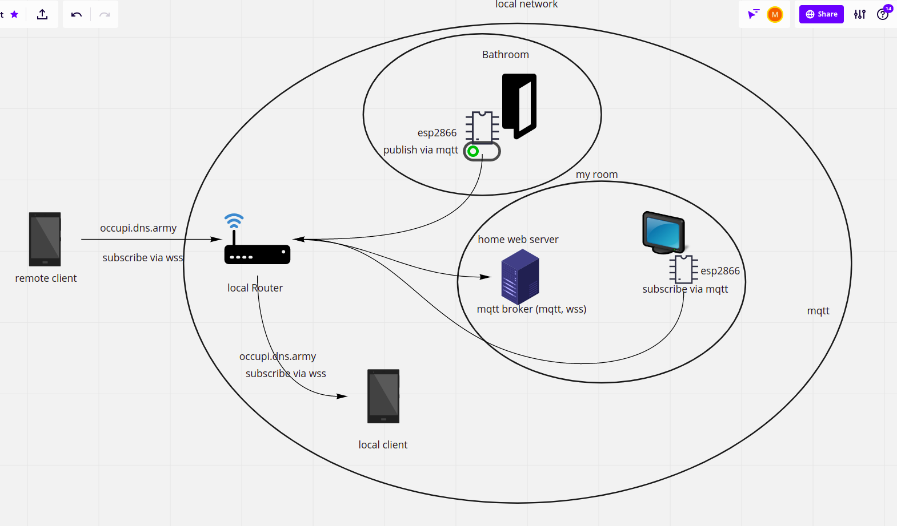

# OCCUPI
IoT project to monitor bathroom activity^^. A reed switch which allows to get the status of a door.
This architecture makes use of ESP2866 chips and communicates via MQTT.

## Overview

***Techstack***
- [Aedes MQTT Broker](https://www.npmjs.com/package/aedes)
- [Arduino IDE](https://www.arduino.cc/)
- [ESP2866](https://github.com/esp8266/Arduino)
- [NGINX](https://www.nginx.com/)
- [Docker](https://www.docker.com/)
- [mqttjs](https://www.npmjs.com/package/mqtt)

## Enviroment Setup
 **Checklist**
- 2x ESP2866 [the ones used in my implementation](https://www.amazon.de/-/en/AZDelivery-NodeMCU-ESP8266-ESP-12F-Development/dp/B0754HWZSQ/ref=sxts_sxwds-bia-wc-drs1_0?adgrpid=82019923196&cv_ct_cx=nodemcu+esp8266&dchild=1&gclid=CjwKCAiA7939BRBMEiwA-hX5J3R3pp34Z092bbDAk62LzSkU-gniknieJLFWonhltPmgHDvJhL3wKxoC9hgQAvD_BwE&hvadid=394695513971&hvdev=c&hvlocphy=9043087&hvnetw=g&hvqmt=b&hvrand=14331046880173804529&hvtargid=kwd-297503178476&hydadcr=4900_1792553&keywords=nodemcu+esp8266&pd_rd_i=B0754HWZSQ&pd_rd_r=4e27b684-7e04-46f1-8df6-f4e1ed5d9dfa&pd_rd_w=6bOBD&pd_rd_wg=bMVUs&pf_rd_p=10e68c58-2c30-45f0-9479-867ac48fc4e5&pf_rd_r=05DQHQRNC9VQGYBT5RGT&psc=1&qid=1605881547&sr=1-1-69f2aa40-4718-4485-ba0d-6c4119696677&tag=googdemozdesk-21)
- Server (Raspberry pi, local or remote Server)
- reed switch (depends on your door lock)
- lcd display (I used 16x2 with I2C module)

### Reed Switch Circuit

Depending on your door you'll have to adjust here. You also don't have to add the resistor in your implementation but rather use an internal pull up resistor.

### LCD Circuit

### Server Setup
I used nginx as reverse proxy and for serving the files of the PWA front end application. In order for it to work properly you should enable tls. 
I used certbot and letsencrypt for that matter.

### Author
- Martin Gressler - [@martingrzzler](https://github.com/martingrzzler)
